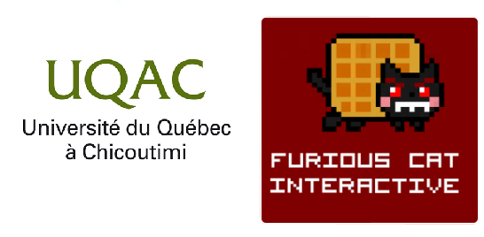
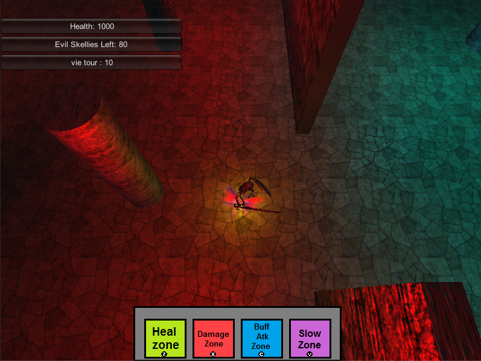

# LeRetourD'Abargoch
## Projet de fin de session pour le cour de conception de jeux video UQAC

### Steven Gerard, Corentin Raoult, Loïc Tessier
### Automne 2014

#### Mécaniques de jeu
* beat'em all, éliminer le plus d'ennemis possible
* placez les zones pour vous aider à empêcher les ennemis d'atteindre le portail dimensionnel

#### Contrôles
* flèches directionelles du clavier pour bouger le personnage
* "z", "x", "c", "v" pour placer les différentes zones
* "espace" pour attaquer les ennemis
* souris pour les menus et la sélection des améliorations

#### Contenu de la démo:
* implémentation de la partie beat'em all et quelques zones de défense
* deux niveaux avec une seule vague d'ennemis
* dès que la vague commence on ne peut plus placer les zones de défense

#### Screenshot

